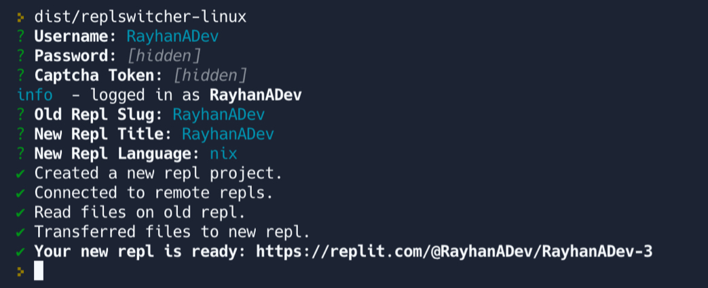

# ReplSwitcher



A little CLI tool to assist in transferring one
Repl project to another Repl project, allowing
you to change the language of the Repl in the
process.

## Install
You may install any of the binaries included in
[`/dist/`](https://github.com/rayhanadev/replswitcher/tree/master/dist)
or via NPM/Yarn.

```bash
# with NPM
$ npm install replswitcher -g

# with Yarn
$ yarn global add replswitcher
```

# Usage
Open up a shell and run `replswitcher` and you
should be prompted to login and then the
switching wizard will start running.

**Note**: To login you will need a hCaptcha
token. These can be created on my website
[Replit Captcha Tokens](https://replit-captcha.rayhanadev.repl.co).